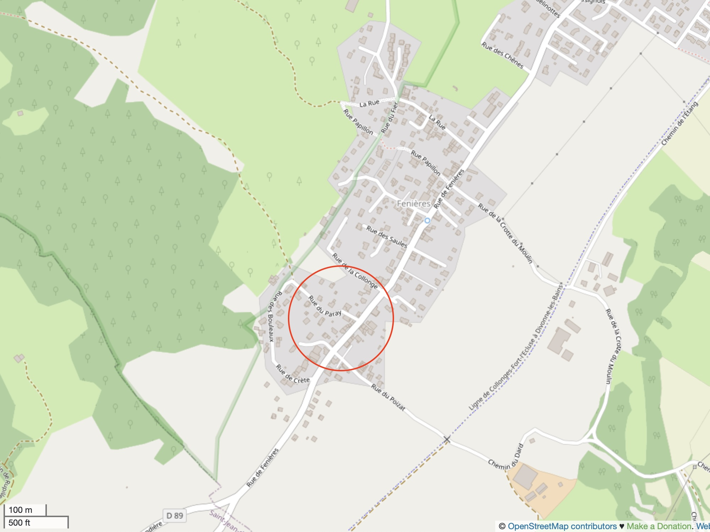

## Dimensions

- 149m2 habitable area, spread over ground floor, first floor and converted loft
  - Open aspect with windows on 3 sides: east, west, and north
- 125m2 garden area, with driveway (for 2 cars), carport, garden shed and wood storage

### Principle Room Areas (approximate)

- Living Room 26m2
- Dining Room 10m2
- Kitchen 7m2
- Mezzanine 14m2
- First Bedroom 12m2
- Second Bedroom 11m2
- Master Bedroom 22m2

## Heating and Cooling

- Hitachi air-air heat pump, offering winter heating and summer cooling in the loft and ground floor (installed 2021)
- Hitachi air-water heat pump, supplying central heating and domestic hot water (installed 2021)

## Kitchen

- Fitted kitchen
  - 4 ring induction hob
  - new electric oven (under guarantee)
  - built-in fridge

## Energy Performance

- Energy Performance: **C**, 159kWh/m2/year
- Greenhouse Gas Emissions: **A**, 5kg CO2/m2/year

## Location

The house is situated in the southern part of Thoiry, in Fenières. There are
ample local shopping facilities in the Val Thoiry shopping centre. Geneva (CERN)
is just a 10 minute drive away; or a safe cycle along the green way and quiet
agricultural roads.

Walking just 150 metres from the house one arrives at the Jura mountain
forest. Local ski stations are just 10 minutes drive and the Alps can be
reached in about 1 hour by car.

  

    

      
    

  

