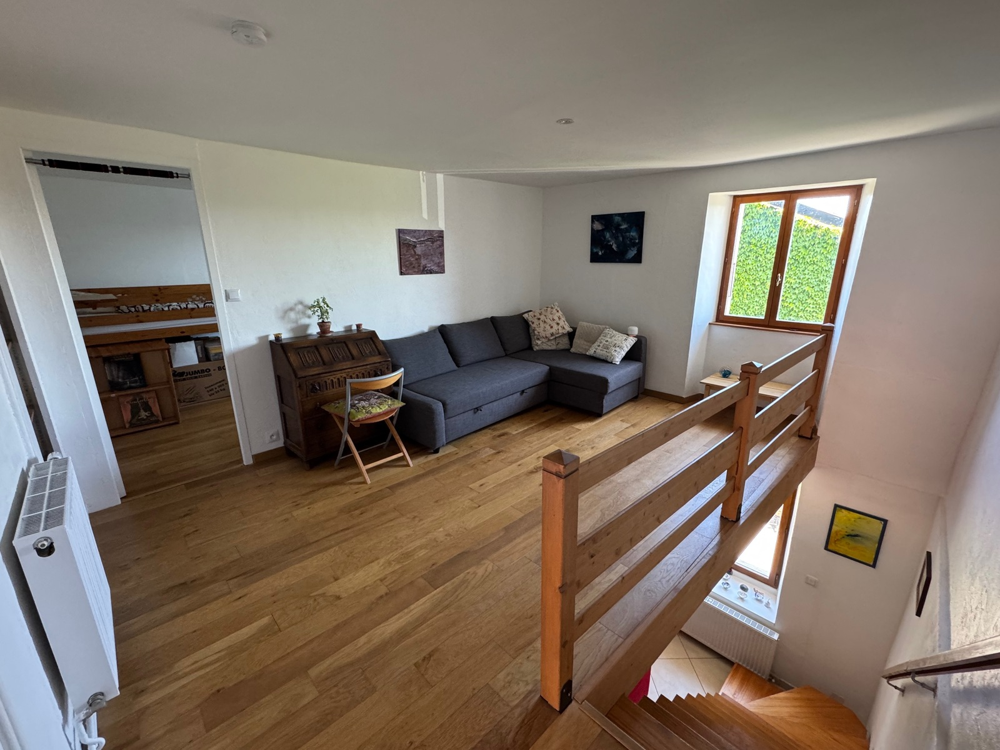
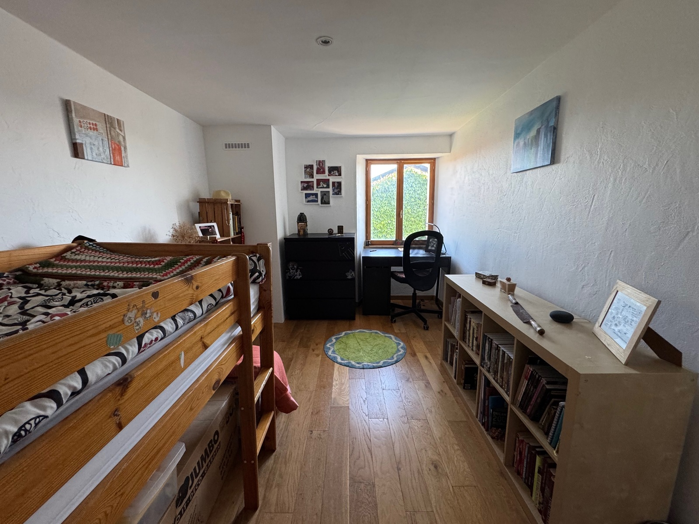
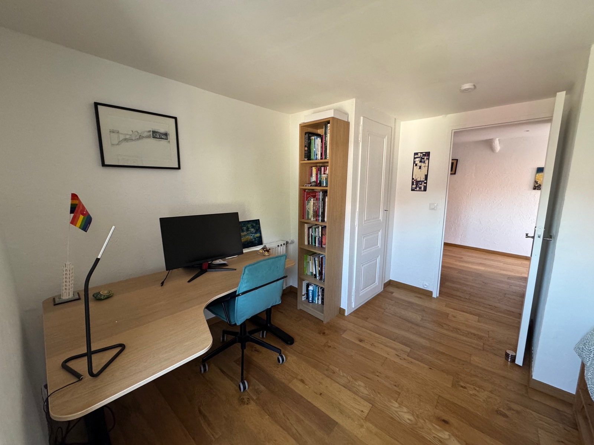
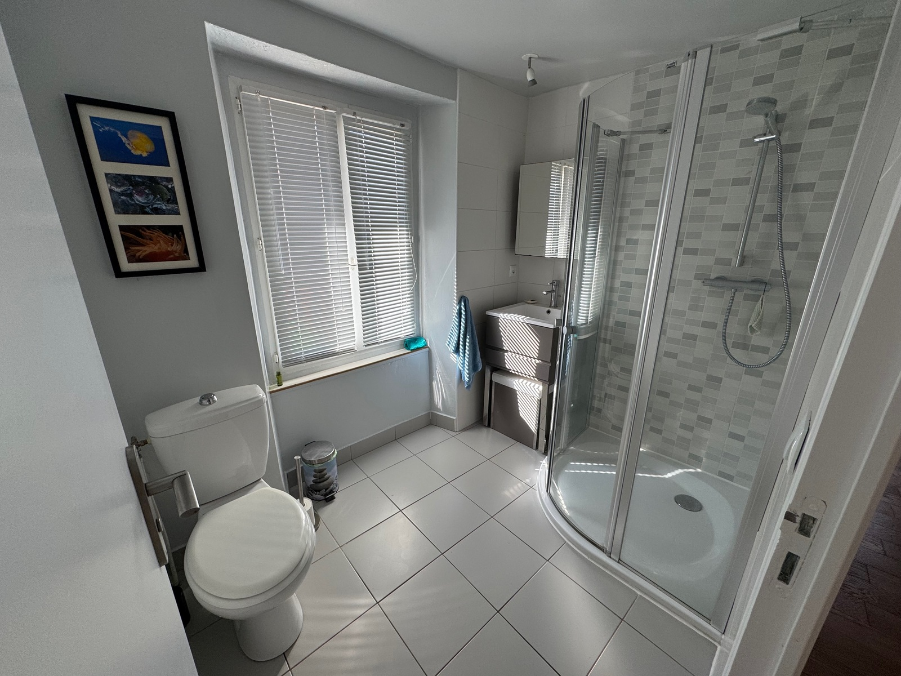
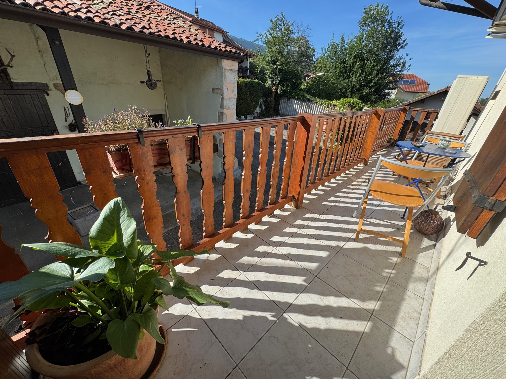
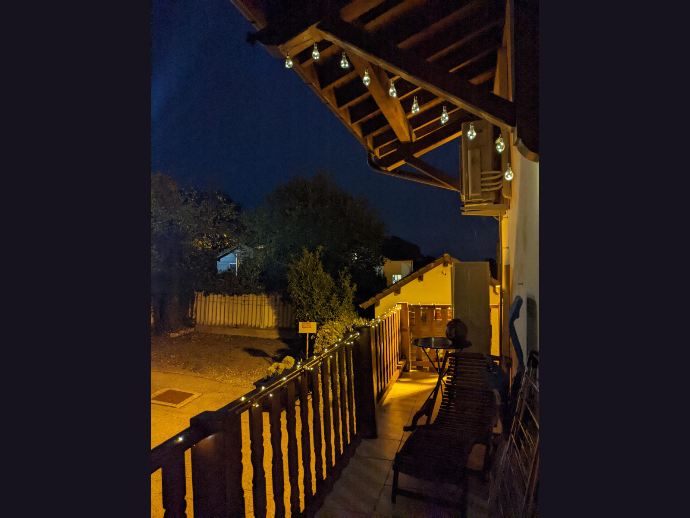

## The First Floor

The first floor of the house has two well proportioned bedrooms, a relaxing mezzanine space, a modern shower room, and a hall leading out to the balcony area. 

The mezzanine could easily be converted into a study or fourth bedroom.

  

    <button type="button" data-bs-target="#carouselFirstFloor" data-bs-slide-to="0" class="active" aria-current="true" aria-label="Slide 1"></button>
    <button type="button" data-bs-target="#carouselFirstFloor" data-bs-slide-to="1" aria-label="Slide 2"></button>
    <button type="button" data-bs-target="#carouselFirstFloor" data-bs-slide-to="2" aria-label="Slide 3"></button>
    <button type="button" data-bs-target="#carouselFirstFloor" data-bs-slide-to="3" aria-label="Slide 4"></button>
    <button type="button" data-bs-target="#carouselFirstFloor" data-bs-slide-to="4" aria-label="Slide 5"></button>
    <button type="button" data-bs-target="#carouselFirstFloor" data-bs-slide-to="5" aria-label="Slide 6"></button>
    <button type="button" data-bs-target="#carouselFirstFloor" data-bs-slide-to="6" aria-label="Slide 7"></button>
  

  

    

      
      

        <h5>The mezzanine space</h5>
      

    

    

      
      

        <h5>The first bedroom</h5>
      

    

    

      
      

        <h5>The second bedroom</h5>
      

    

    

      
      

        <h5>First floor shower room</h5>
      

    

    

      
      

        <h5>The hall leads to the balcony</h5>
      

    

    

      
      

        <h5>The balcony is a splendid place for flowers and views of the Jura mountains</h5>
      

    

    

      
      

        <h5>The balcony at night</h5>
      

    

  

  <button class="carousel-control-prev" type="button" data-bs-target="#carouselFirstFloor" data-bs-slide="prev">
    
    Previous
  </button>
  <button class="carousel-control-next" type="button" data-bs-target="#carouselFirstFloor" data-bs-slide="next">
    
    Next
  </button>

