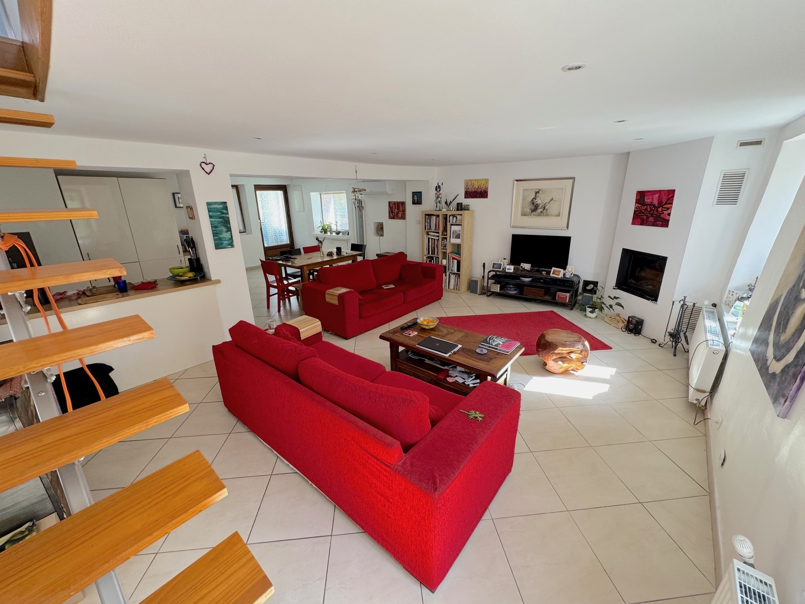
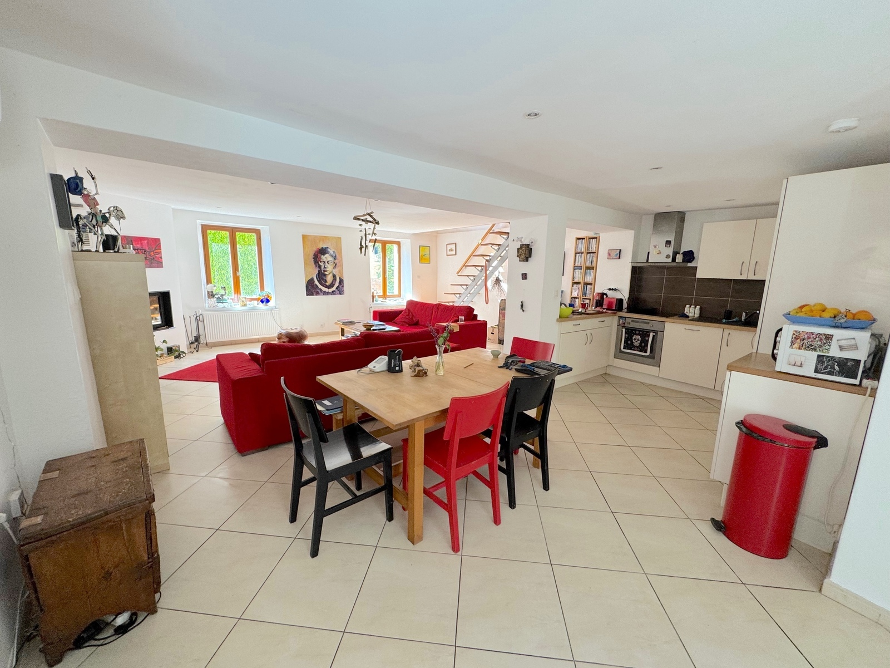
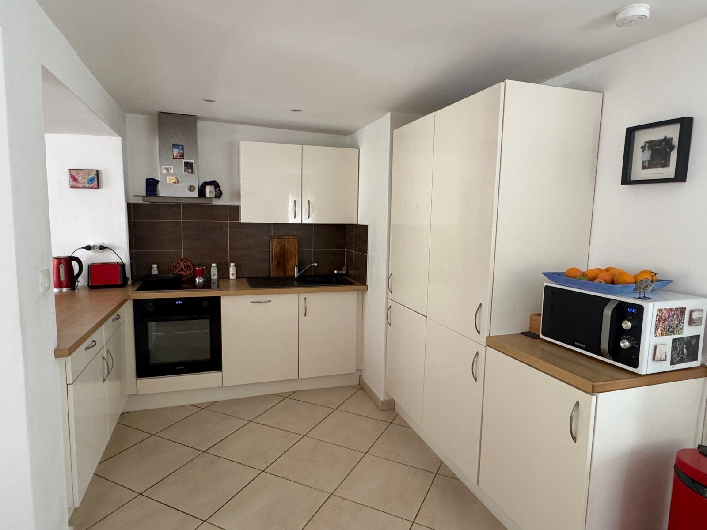
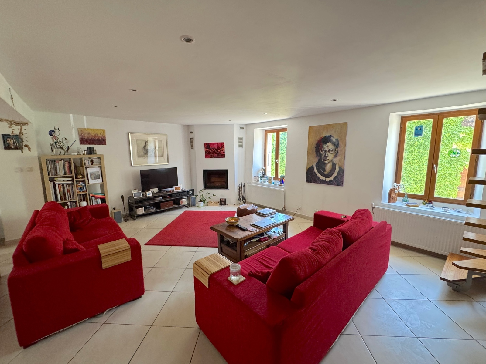

## The Ground Floor

The ground floor of the house is laid out as a large open-plan space, with living room, dining area and kitchen all connected. Additionally, the ground floor has a toilet; an area for coats, shoes, etc.; the entrance porch has a small utility room to the side, for a washing machine and freezer. There is a wood burning stove, as well as central heating radiators and air conditioning, for year-round comfort and charm.

  

    <button type="button" data-bs-target="#carouselGroundFloor" data-bs-slide-to="0" class="active" aria-current="true" aria-label="Slide 1"></button>
    <button type="button" data-bs-target="#carouselGroundFloor" data-bs-slide-to="1" aria-label="Slide 2"></button>
    <button type="button" data-bs-target="#carouselGroundFloor" data-bs-slide-to="2" aria-label="Slide 3"></button>
    <button type="button" data-bs-target="#carouselGroundFloor" data-bs-slide-to="3" aria-label="Slide 4"></button>
  

  

    

      
      

        <h5>The open-plan living room space</h5>
      

    

    

      
      

        <h5>The ground floor</h5>
      

    

    

      
      

        <h5>The kitchen</h5>
      

    

    

      
      

        <h5>The open-plan living room space</h5>
      

    

  

  <button class="carousel-control-prev" type="button" data-bs-target="#carouselGroundFloor" data-bs-slide="prev">
    
    Previous
  </button>
  <button class="carousel-control-next" type="button" data-bs-target="#carouselGroundFloor" data-bs-slide="next">
    
    Next
  </button>

