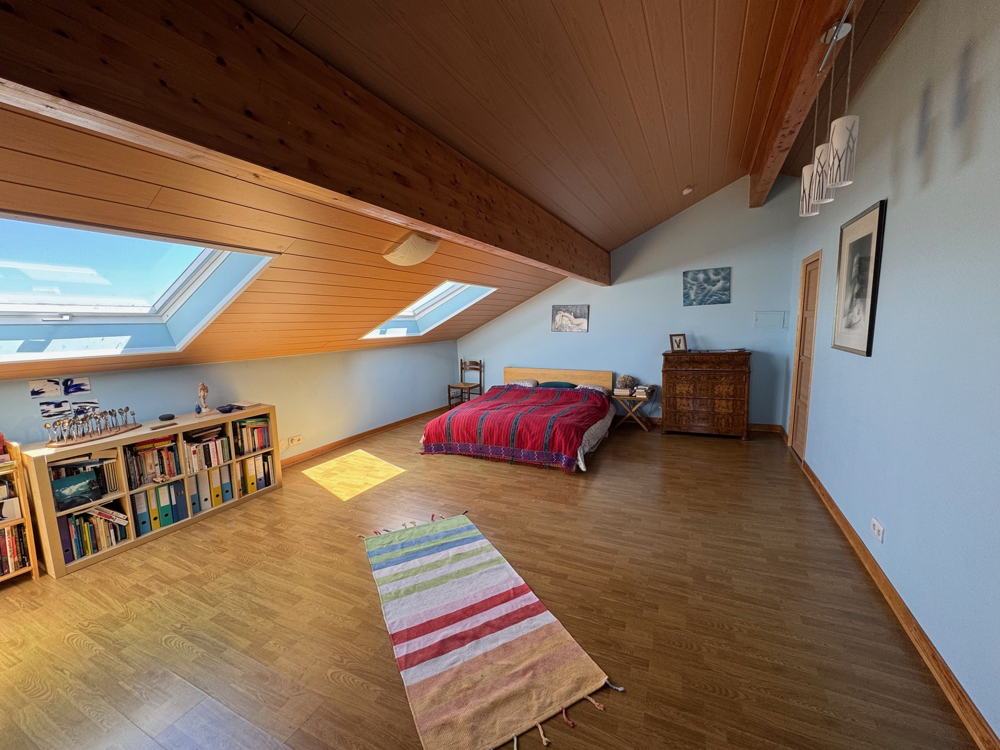
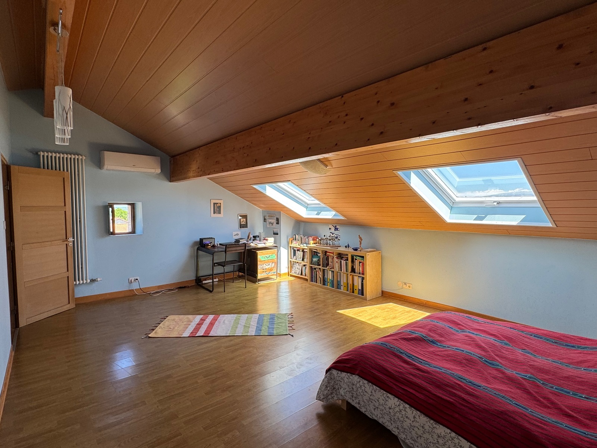
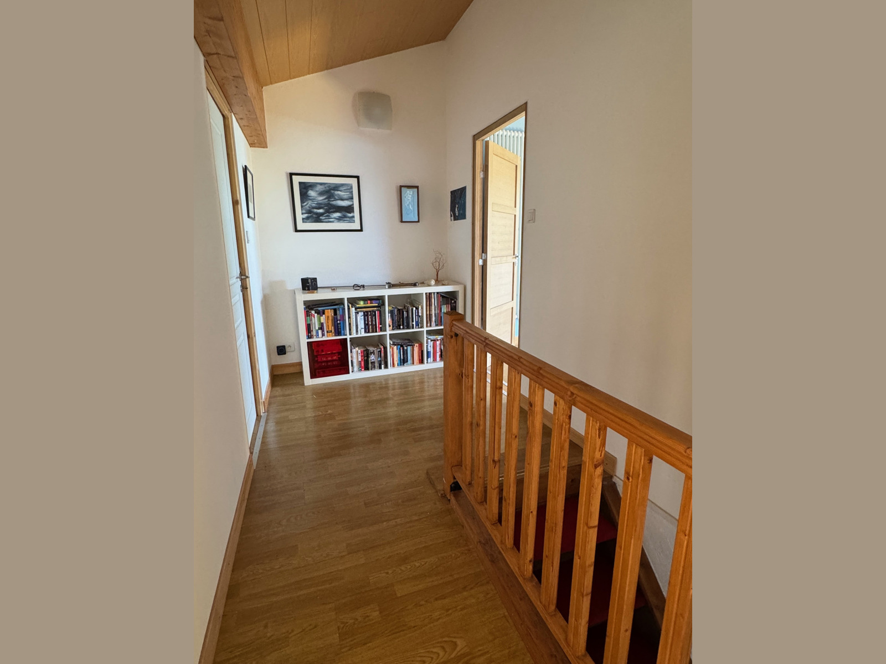
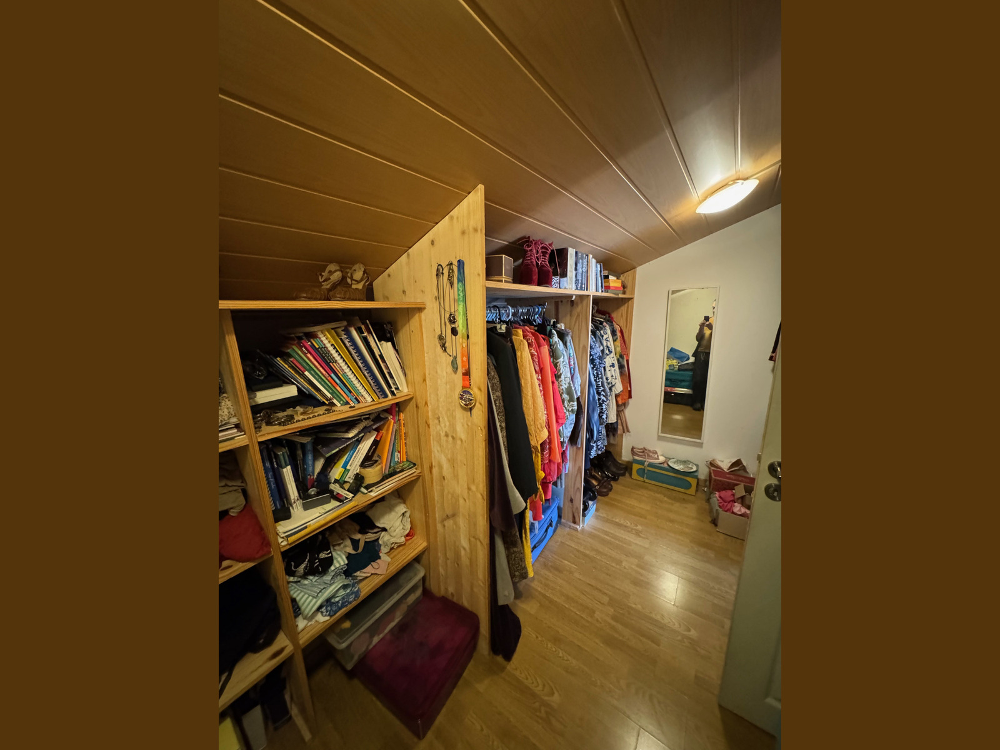
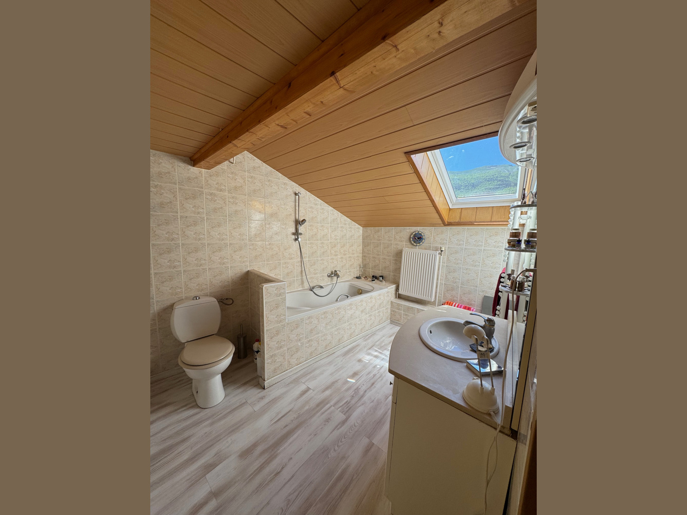

## The Loft

The converted loft space of the house offers a huge master bedroom, with ample
space for relaxing and exercising. From the air-air heat pump the room is
comfortable all year long. There is a large walk-in dressing room and a
bathroom, with shower and bath.

From the bedroom the Alps are visible and the Jura can be seen from the
bathroom.

  

    <button type="button" data-bs-target="#carouselLoft" data-bs-slide-to="0" class="active" aria-current="true" aria-label="Slide 1"></button>
    <button type="button" data-bs-target="#carouselLoft" data-bs-slide-to="1" aria-label="Slide 2"></button>
    <button type="button" data-bs-target="#carouselLoft" data-bs-slide-to="2" aria-label="Slide 3"></button>
    <button type="button" data-bs-target="#carouselLoft" data-bs-slide-to="3" aria-label="Slide 4"></button>
    <button type="button" data-bs-target="#carouselLoft" data-bs-slide-to="4" aria-label="Slide 5"></button>
  

  

    

      
        

          <h5>The master bedroom</h5>
        

    

    

      
        

          <h5>The master bedroom, second view</h5>
        

    

    

      
        

          <h5>The upper hall of the loft</h5>
        

    

    

      
        

          <h5>The dressing room</h5>
        

    

    

      
        

          <h5>The bathroom, exclusive use for the master bedroom</h5>
        

    

  

  <button class="carousel-control-prev" type="button" data-bs-target="#carouselLoft" data-bs-slide="prev">
    
    Previous
  </button>
  <button class="carousel-control-next" type="button" data-bs-target="#carouselLoft" data-bs-slide="next">
    
    Next
  </button>

